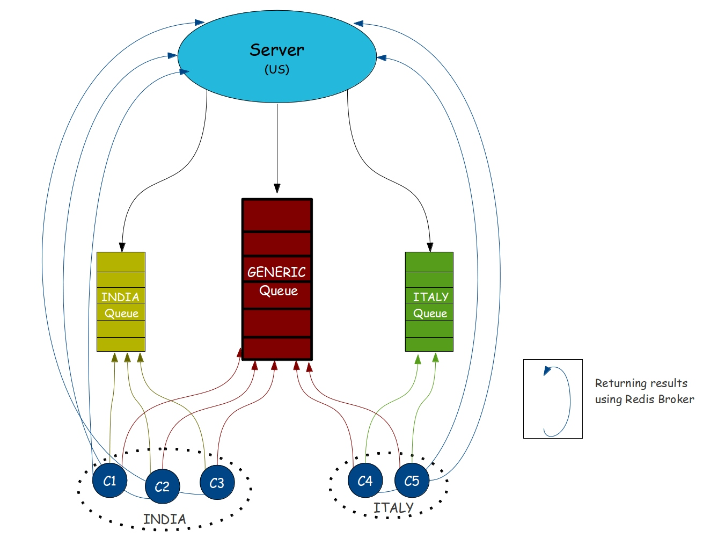

.. _intro:

*********************
Introduction to ThugD
*********************

**ThugD** as the name suggests stands for **Thug Distributed** adding the Distributed functionality to the Thug project.

ThugD's Architecture comprises of:       

* **Server**  : Containing bulk of URLs (fed by spamtraps).
* **Workers** : Thug Instances (running across the globe).

Till now Thug was working like a stand-alone tool and didn't provided any way to distribute URL analysis tasks to different workers. For the same reason it is neither able to analyze difference in attacks to users according to their geolocation (unless it is provided a set of differently geolocated proxies to use obviously). 

But now with Thug Distributed we are be able to solve the problem. Now we have a Centralized Server which will be connected to all the Thug instances running across the globe and will distribute URLs (according to geolocation analysis requirements). After that the clients will consume the tasks distributed by centralized server, process them and return back the results to the server using HpFeeds.

Architecture
############

    
Implementation
###############
  
* ThugD maintains a Centralized Server which is fed up with bunch of URLs(collected from Spamtraps). 
* Then it distributes these URLs into 2 different types of Queues(Generic & Geolocation based) according to the geolocation analysis requirements.
* While on the other side whenever a Worker(client) starts the Thug Instance anywhere across the globe it will automatically be connected to both queues(Generic and its Country Queue like: IN(India), IT(Italy)).
* Then if the URLs are present in the any of the connected queue they will be automatically fetched by the Thug Instance. It will process them and return back the results to the server.

Optimizations
#############

* At a time **4 URLs** will be processed in PARALLEL using gevent at every Worker.
* According to Worker's System Performance some URL's will be automatically **prefetched** for later analysis, so that workers with better performance do more work and return results fastly.

